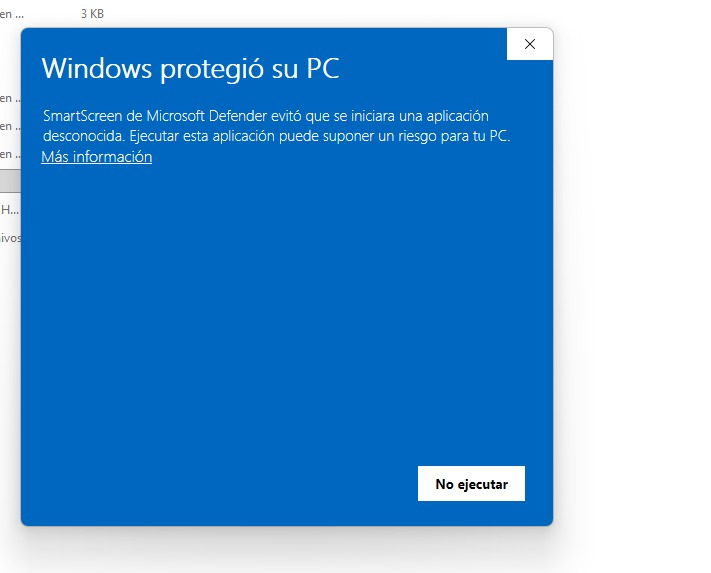
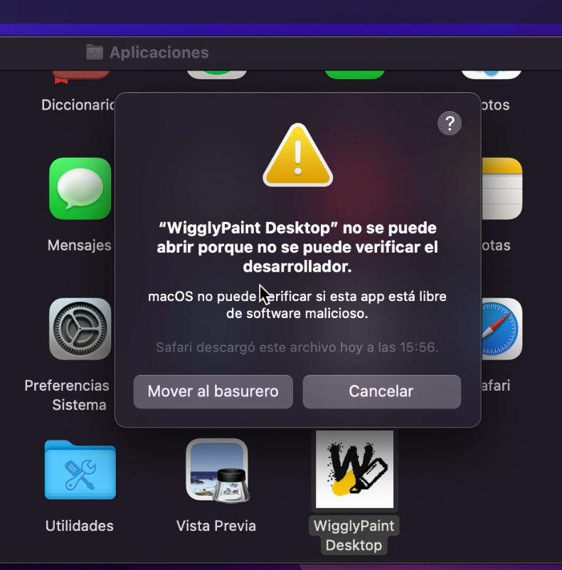
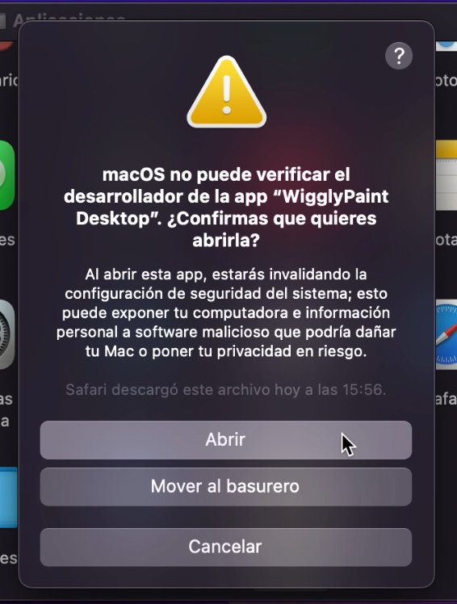

# 🎨 WigglyPaint Desktop

> Desktop packaging of the original **WigglyPaint** HTML application using **Electron**.

⚠️ **Unofficial desktop adaptation**

This project is **not affiliated with or endorsed by Internet Janitor**.

The original WigglyPaint application was created by **John Earnest (Internet Janitor)**. This repository only provides the Electron packaging, desktop integration, installer configuration, and documentation.

---

## 🌐 Original Project

🎨 **WigglyPaint** — <https://internet-janitor.itch.io/wigglypaint>

---

## 🛡️ Author's Notice

Before using or sharing WigglyPaint, please read the author's message regarding scam websites, fake desktop applications, and unauthorized redistributions.

📢 [**Please don't fall for scams**](https://internet-janitor.itch.io/wigglypaint/devlog/1449946/please-dont-fall-for-scams)

The author has clarified that WigglyPaint is **free and open source**, and warns users about fake websites and applications pretending to be official versions.

---

## 📝 Development Story

Read the full development story and technical process behind this project:

📖 [**How a Drawing App Reminded Me Why I Enjoy Building Software**](https://medium.com/@jdofalcon/c%C3%B3mo-una-aplicaci%C3%B3n-de-dibujo-me-record%C3%B3-por-qu%C3%A9-disfruto-desarrollar-software-c859963afafe)

---

## 📥 Download & Install

Download the latest installer from the **Releases** page:

👉 [**Download the latest release**](https://github.com/jdanifalcon/WigglyPaint-Desktop/releases/latest)

### Windows

1. Download **WigglyPaint-Desktop-Setup-x.x.x.exe** from the Assets section
2. Run the installer
3. If Windows SmartScreen appears, see the [SmartScreen Notice](#%EF%B8%8F-windows-smartscreen-notice) below
4. Choose your installation directory and complete the setup
5. Launch WigglyPaint Desktop from the desktop shortcut or Start Menu

### macOS

1. Download the `.dmg` file that matches your Mac:
   - **Intel Mac** → `WigglyPaint-Desktop-Setup-x.x.x-x64.dmg`
   - **Apple Silicon (M1/M2/M3/M4)** → `WigglyPaint-Desktop-Setup-x.x.x-arm64.dmg`
2. Open the `.dmg` file
3. Drag **WigglyPaint Desktop** into your **Applications** folder
4. If macOS Gatekeeper blocks the app, see the [Gatekeeper Notice](#-macos-gatekeeper-notice) below
5. Launch WigglyPaint Desktop from Applications or Launchpad

> 💡 **Not sure which Mac you have?** Click the Apple menu () → "About This Mac". If the Chip says "Apple M1" or similar, download the arm64 version. If it says "Intel", download the x64 version.

---

## 📷 Screenshots

<p align="center">
  
</p>

---

## ✨ Features

- 🖥️ Native desktop application for **Windows** and **macOS**
- 🎨 Same original WigglyPaint experience
- ⚡ Electron-powered desktop packaging
- 📦 Windows installer (.exe) and macOS disk image (.dmg)
- 🍎 macOS builds for both Intel (x64) and Apple Silicon (arm64)
- 🚀 Simple installation with desktop and Start Menu / Launchpad shortcuts
- ⚙️ Automated macOS builds via GitHub Actions
- ❤️ Open-source learning project

---

## ⚠️ Windows SmartScreen Notice

When running the installer for the first time, Windows SmartScreen may display a warning saying **"Windows protected your PC"**. This is expected behavior — it happens with any independently distributed application that is not signed with a paid code-signing certificate.

**This does not mean the application is harmful.** The source code is fully available in this repository for review.

<p align="center">
  
</p>

### How to proceed:

1. Click **"More info"** on the SmartScreen dialog
2. Click **"Run anyway"**
3. The installation will continue normally

> 💡 **Why does this happen?** Microsoft SmartScreen flags executables that are not digitally signed with a trusted certificate. Code-signing certificates cost $70–$200 USD/year, which is not feasible for independent open-source projects. This is common across many Electron-based applications and open-source tools distributed outside the Microsoft Store.

---

## 🍎 macOS Gatekeeper Notice

When opening WigglyPaint Desktop for the first time on macOS, you may see a warning saying the app **cannot be opened because the developer cannot be verified**. This is expected behavior — it happens with any application that is not signed with a paid Apple Developer certificate.

**This does not mean the application is harmful.** The source code is fully available in this repository for review.

<p align="center">
  
</p>

### How to proceed:

1. **Right-click** (or Control-click) on the app in your Applications folder
2. Select **"Open"** from the context menu
3. A new dialog will appear with an **"Open"** button — click it

<p align="center">
  
</p>

4. The app will launch normally from now on

> ⚠️ **Older Macs (Intel / pre-Ventura):** The "Open" button may not appear in the first dialog. In that case, go to **System Preferences** → **Security & Privacy** → **General**, and click **"Open Anyway"** next to the message about WigglyPaint Desktop. On newer Macs (Ventura and later), this option is in **System Settings** → **Privacy & Security**.

> 💡 **Why does this happen?** macOS Gatekeeper requires applications to be signed with an Apple Developer certificate ($99 USD/year). This is not feasible for independent open-source projects. This is common across many Electron-based applications and open-source tools distributed outside the Mac App Store.
---

## 🛠️ Build From Source

If you want to build the application yourself:

```bash
git clone https://github.com/jdanifalcon/WigglyPaint-Desktop.git
cd WigglyPaint-Desktop
npm install
npm start        # Run in development mode
npm run build    # Generate the installer (output in dist/)
```

> ⚠️ **Note:** Windows builds can only be generated on Windows, and macOS builds can only be generated on macOS. This project includes a [GitHub Actions workflow](.github/workflows/build-macos.yml) to automate macOS builds in the cloud.

---

## 🧰 Tech Stack

| Tool | Purpose |
|------|---------|
| Electron | Runtime — wraps the HTML app in a native desktop window |
| electron-builder | Packaging — generates .exe (NSIS) and .dmg installers |
| Node.js / npm | Development environment and dependency management |
| GitHub Actions | CI/CD — automated macOS builds using `macos-latest` |
| Git / GitHub | Version control, releases, and distribution |

---

## 📁 Project Structure

```text
WigglyPaint-Desktop/
├── .github/
│   └── workflows/
│       └── build-macos.yml
├── assets/
│   ├── icon.ico
│   ├── icon.icns
│   └── screenshots/
│       ├── hola.gif
│       ├── smartscreen-warning.jpeg
│       ├── macos-warning.png
│       └── macos-warning-01.png
├── main.js
├── package.json
├── WigglyPaint.html
├── README.md
└── LICENSE
```

---

## 🐛 Known Issues & Solutions

During development, several common issues were encountered and resolved. These are documented here for anyone who wants to build or fork this project.

| Issue | Cause | Solution |
|-------|-------|----------|
| `EJSONPARSE` error on `npm start` | Malformed JSON in package.json (misplaced braces) | Fix JSON structure — validate with a JSON linter |
| `publisherName` schema validation error | electron-builder v26 deprecated this field inside `win` | Remove the `publisherName` field |
| Windows SmartScreen warning | Unsigned executable | Expected behavior — [see notice above](#%EF%B8%8F-windows-smartscreen-notice) |
| macOS Gatekeeper block | Unsigned application | Expected behavior — [see notice above](#-macos-gatekeeper-notice) |
| macOS `.dmg` not compatible | Build was arm64, Mac was Intel (or vice versa) | Configure `arch: ["x64", "arm64"]` to build for both |
| GitHub Actions publish error | Workflow tried to auto-publish without a `GH_TOKEN` | Add `--publish never` to the build command |
| LF/CRLF warnings | Line ending conversion between Windows and Git | Not an error — Git auto-converts; can be configured in `.gitattributes` |

---

## 🤝 Contributing

Contributions are welcome! Check the [open issues](https://github.com/jdanifalcon/WigglyPaint-Desktop/issues) for planned features, or feel free to open a new one.

---

## ❤️ Acknowledgements

- 🎨 Original application by **John Earnest (Internet Janitor)**
- ⚙️ Desktop packaging by **Jessica Falcón**
- 💙 Thanks to the open-source community and everyone supporting creative software.

---

## 📄 License

The original WigglyPaint project is released under the **MIT License**.

This repository preserves the original attribution while providing the Electron desktop packaging and documentation.
